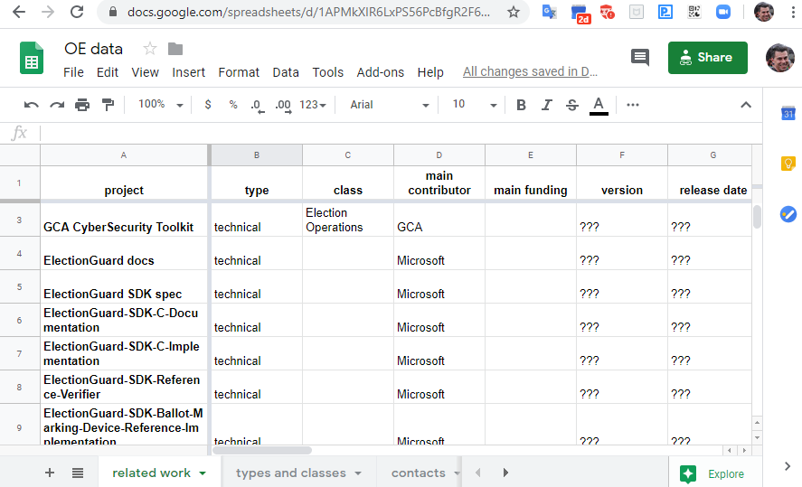

# Open Elections

# OE Documentation
1. [Jun 2019 - present: Public Open Elections meetings](https://docs.google.com/document/d/19dnBvyUCzGZkBKKSkeLVnRktHQ_OpHdTIthmnxWcWLU/edit?usp=sharing)
1. [Dec 2019 - present: Lincoln OE meetings](https://docs.google.com/document/d/1Ayc5zLKnqbVlv90jlSaASlEhG5U7XSOapHKnVEWa9FI/edit?usp=sharing)
1. [Jan 2020: Election Security Grant Funding Proposal 2020](https://docs.google.com/document/d/1CP1bWHd1jGUM2PL8DNemZ2YxqqNlVTfAL3KLiXV9etk/edit?usp=sharing)
1. [Dec 2019: Planning the Organization](https://docs.google.com/document/d/1mEeXGE0sRmKXX3RnAbf4gXgaKp3X4WRWiJ1G0JUkh1c/edit?usp=sharing)
1. [Dec 2019: Planning: Outline of Election Security Needs for 2020](https://docs.google.com/document/d/1GNWMvz-dliDvWp4uR392-415c71R-11WZK4xnrlGX98/edit?usp=sharing)
1. [Sept 2019: Open Elections Grant Funding Drafts](https://drive.google.com/open?id=17R4Ibhv7djAByH5U_yuP5C5zy7MHXswuML6tRyjCPmw)
1. [May 2019: Planning, Open Elections First Meetings](https://docs.google.com/document/d/1wX7UctI4FiD2FPkM7_iRvvNzMGfRxPh9T1Ij4rvDcQM/edit?usp=sharing)
1. [Apr 2019: Open Elections Business Plan](https://drive.google.com/open?id=1UzwmzwzxRVY3KtWBnFttjjX0feWXqG5GThJfs1FkHSc)

# OE Research
1. [31Jan2020 - 01Feb2020 NASS and NASED Conference Notes](https://docs.google.com/document/d/1lRLEc68x9wIV01VbCLulXtKFY6nXWEfzw1Teo1BCvxQ/edit?usp=sharing
1. [Open Source Elections Systems, history and references](https://docs.google.com/document/d/1J-sUHg8EyIgPNPFrGlVok6MK1y1DrFDn6OnllC-7HEA/edit?usp=sharing)
1. [Apr 2018 GAO Observations on Voting Equipment Use and Replacement](https://www.gao.gov/assets/700/691201.pdf)
1. [Apr 2019: Briefing on Open Source Election systems, STAR-vote, VSAP, and 6 Open Source Elections Projects](https://osvtac.github.io/files/meetings/2019/2019-05-14/packet/OSV_State_of_the_Art_Brief_for_TAC_Review.pdf)

## Lincon staff ops Documentation
1. [Lincoln staff HR zenefits](https://secure.zenefits.com/)
1. [Lincoln staff slack](https://lincoln-labs.slack.com/)
1. [Lincoln staff invoicing, AR](http://bill.com/)

# [Related Work and Contacts](https://docs.google.com/spreadsheets/d/1APMkXIR6LxPS56PcBfgR2F619AZ_ECWsh_eXlkU1Hzo/edit?usp=sharing)

We should move this into a JSON page and present as a filterable, sortable html table. By being JSON, anyone can contribute and update the source data.

# Reports
1. Largest organizations: [Compare ElectionGuard, Galois Free & Fair, and Code for America's open elections project](https://www.openhub.net/p/_compare?project_1=Free+and+Fair&project_2=openelections-project&project_0=ElectionGuard)
1. Largest codebases: [Compare ElectionGuard, VotingWorks, and Galois Free & Fair](https://www.openhub.net/p/_compare?project_0=ElectionGuard&project_1=VotingWorks&project_2=Free+and+Fair)

# Events
1. List a few past events here: Redmond meeting, Blackhat vegas, ...
1. [09 Jan 2020, Election Security-Perspectives From Voting System Vendors And Experts](https://cha.house.gov/committee-activity/hearings/2020-election-security-perspectives-voting-system-vendors-and-experts)
1. [30 Jan - 02 Feb 2020 NASS/NASED conference, Washington DC](https://www.nass.org/events/nass-2020-winter-conference)
1. [06-07 Feb 2020 Microsoft Ignite, Washington, D.C.: ](https://www.microsoft.com/en-us/ignite-the-tour/washington-dc)
1. [24-28 Feb 2020 RSA Conference 2020, San Francisco, Calif](https://www.rsaconference.com/usa)
1. [31 March-03 April 2020 Black Hat Asia 2020, Singapore](https://www.blackhat.com/asia-20/)

# News
1. [Code for America 2019 in review](https://medium.com/code-for-america/the-year-in-review-at-code-for-america-b52b2726aad8)
1. [CfA brigade congress Nov 2019](https://medium.com/code-for-america/growing-the-civic-tech-movement-68f5ab5ac2ae)
1. [Protecting democratic elections through secure, verifiable voting](https://blogs.microsoft.com/on-the-issues/2019/05/06/protecting-democratic-elections-through-secure-verifiable-voting/)
1. [Election security isn't that hard](https://www.politico.com/agenda/story/2019/09/10/election-security-000954)
1. [Enigma 2020 Call for Participation](https://www.usenix.org/conference/enigma2020/call-for-participation)
1. [DHS cyber agency to prioritize election security, Chinese threats](https://thehill.com/policy/cybersecurity/458487-dhs-cyber-agency-to-prioritize-election-security-chinese-threats)
1. [Hackers Take on Darpa's $10 Million Voting Machine](https://www.wired.com/story/darpa-voting-machine-defcon-voting-village-hackers)
1. [Microsoft demos its bid at creating 'secure' voting systems](https://www.engadget.com/2019/07/17/microsoft-demos-electionguard/)
1. [Swing State Voting Systems Were Left Connected to the Internet for Months, Report Says](https://fortune.com/2019/08/08/swing-state-voting-systems-connected-internet-vice-report/)

This page [https://sarob.github.io/operations/oe-community](https://sarob.github.io/operations/oe-community)
